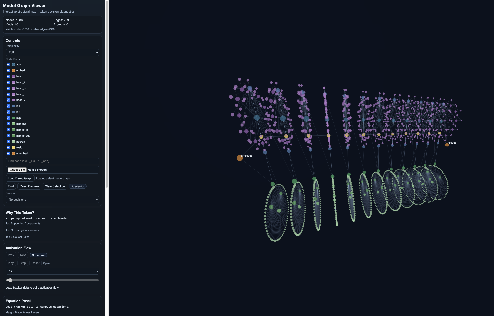

# Prompt-Level Mechanistic Transparency (PLMT)


This project explains why a model emits a token for a prompt by tracing internal computation, especially component activations and residual stream updates in `gpt2-small`.

## Current Status


This project is still a foundation and work in progress.

Right now, we can reliably track which internal components activate during inference for a given prompt and visualize residual-flow-related signals. We can also measure component contributions and run targeted ablations.

What we cannot yet claim is a complete causal explanation of why the model made one exact choice over all alternatives in a fully human-interpretable way. The current system is best treated as mechanistic tracing infrastructure, not a finished theory of model decision-making.

## What We Are Trying To Do

For a prompt and next-token decision, we:
1. Run a forward pass with activation hooks.
2. Decompose logit margin into additive component contributions.
3. Trace source tokens that drove key attention writes.
4. Check faithfulness with internal ablations.
5. Visualize structure + decision flow in the Web UI.

In short: prompt -> internal mechanism -> token decision.

## Why GPT-2 Small

We use `gpt2-small` first because:
1. It is fast and cheap to run locally.
2. It has the same core transformer blocks used in larger decoder-only LLMs.
3. It is easy to instrument with `transformer-lens`.
4. It is practical for debugging the full transparency pipeline before scaling.

## Repo Flow

Current core scripts:
1. `scripts/build_interactive_model_viewer.py`
2. `scripts/run_component_tracker.py`
3. `scripts/visualize_3d_model_map.py`

## Quick Start (End To End)

### 1) Setup environment

```bash
source .venv/bin/activate
pip install -r requirements.txt
```

### 2) Build single payload from one prompt

```bash
python scripts/build_interactive_model_viewer.py \
  --prompt "The secret code is 73914. Repeat the secret code exactly:"
```

Optional flags:
1. `--out outputs/viewer_payload.json` (output path)
2. `--prompt-id my_prompt_001` (stable run label)
3. `--task copy` (task label metadata)
4. `--model gpt2-small` (default is already `gpt2-small`)

Output:
1. `outputs/viewer_payload.json`

Payload fields:
1. `meta`: run metadata
2. `graph`: 3D model nodes/edges
3. `tracker`: prompt decision components/sources/paths
4. `summary`: aggregate statistics

### 3) Start Web UI

```bash
cd webapp
python3 -m http.server 8000
```

Open:
1. `http://localhost:8000`

Then load:
1. `outputs/viewer_payload.json`
