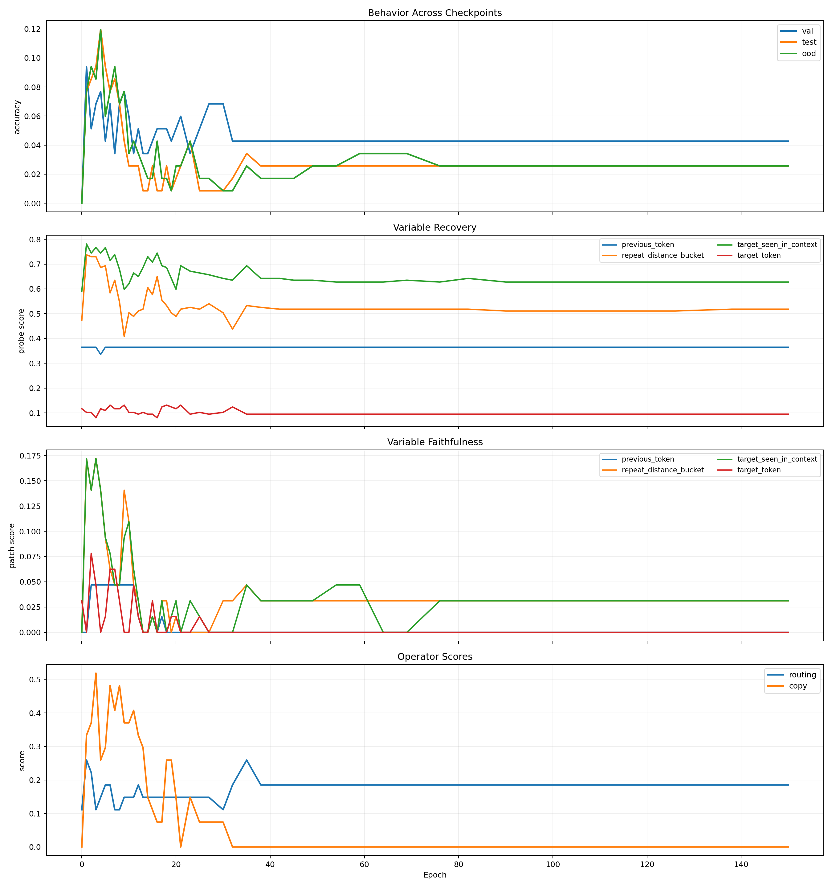
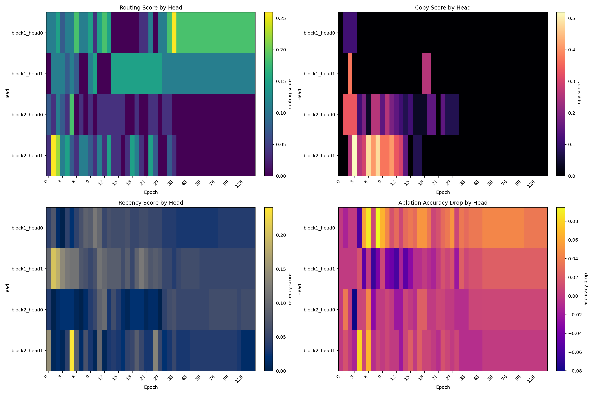
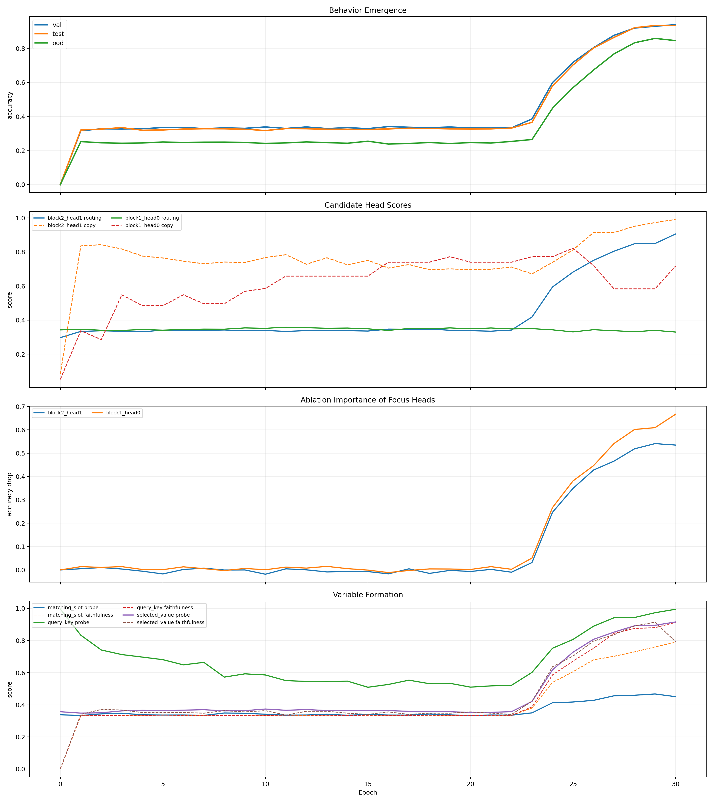
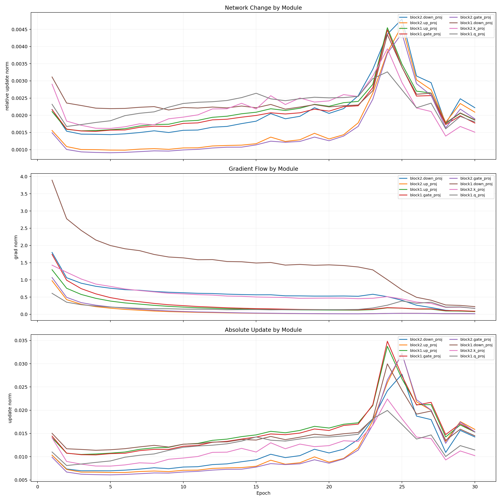
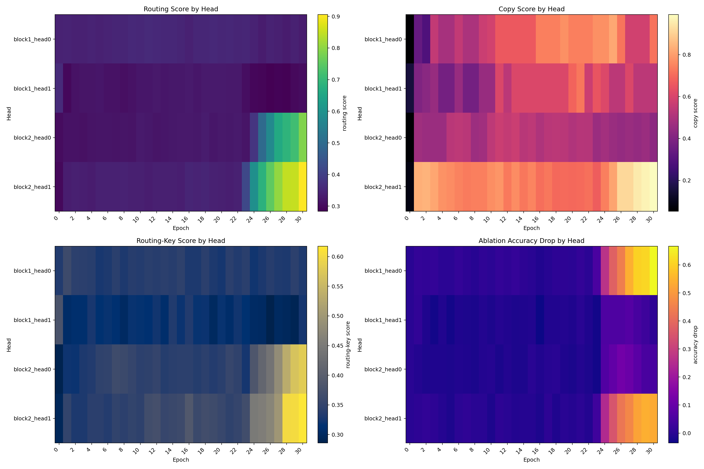
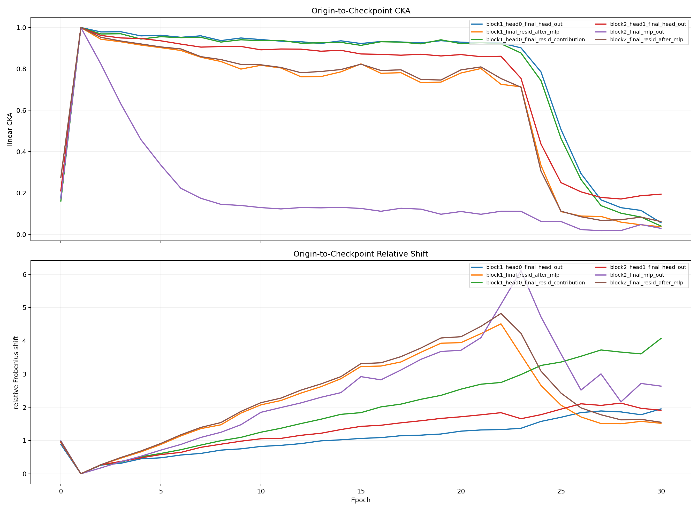
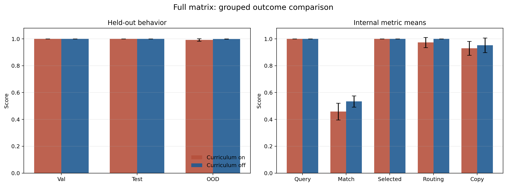
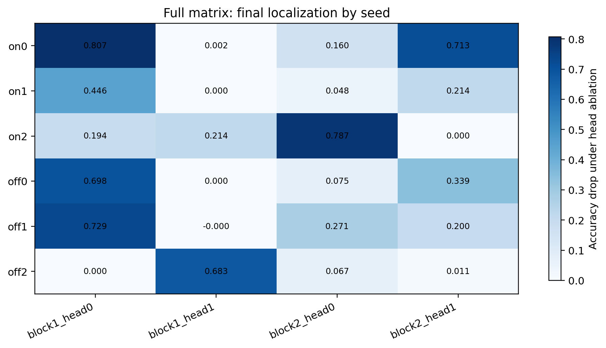
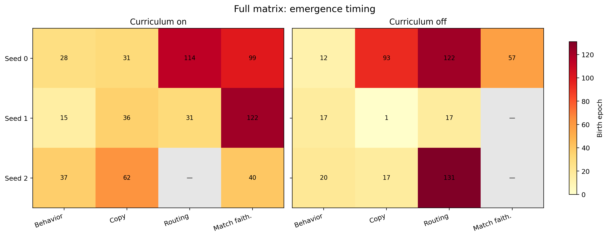
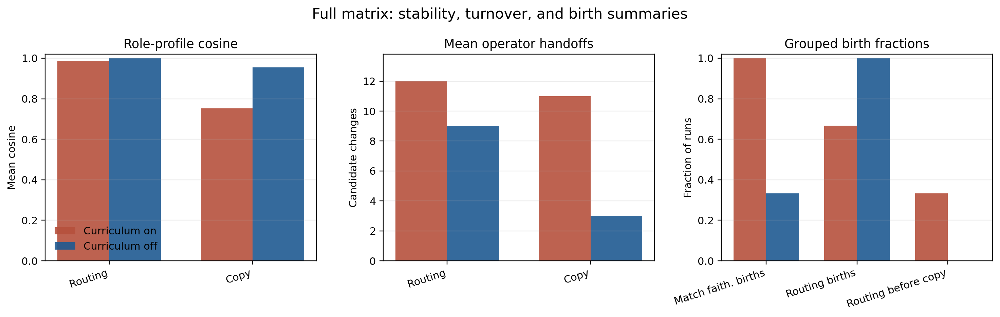

# Retrieval Motif Emergence in Small Transformers

<p class="paper-byline">Nelson Alex<br>6/4/2026</p>

<p class="lead">Controlled in-context retrieval benchmarks, checkpoint-by-checkpoint mechanistic measurements, and a full 150-epoch six-run matrix for studying circuit emergence in small transformers.</p>

<div class="paper-nav">
  <strong>On this page.</strong>
  <a href="#abstract">Abstract</a>
  <a href="#main-result">Main Result</a>
  <a href="#setup">Setup</a>
  <a href="#full-matrix">Six-Run Matrix</a>
  <a href="#formation">How The Circuit Forms</a>
  <a href="#limits">Limits</a>
  <a href="#related-work">Related Work</a>
</div>

<a id="abstract"></a>
## Abstract

Small transformers in these controlled retrieval tasks do not converge to one fixed circuit or one universal birth trajectory. Across seeds and curricula they repeatedly converge to a **stable retrieval motif** while taking **variable formation paths**.

The most stable object is a downstream layer-2 retrieval or write role. Around it sits an additional support computation, strong query-key and selected-value structure, and a matching step that is real but harder to cleanly localize. What varies is the route by which that motif appears: behavior, copy, routing, probe variables, and faithfulness scores do not cross threshold in one fixed order, and exact head identity is not stable across all runs.

I ask two empirical questions: what retrieval mechanism appears inside a small transformer on a controlled in-context retrieval task, and which parts of that mechanism remain stable across training, seeds, and curricula. I answer those questions with three linked experiments: a symbolic key-value task where a retrieval circuit can be reverse-engineered after training, a story next-token benchmark that serves as a negative control and fails in the way a memorizing model should, and a full `150`-epoch six-run textual retrieval matrix tracked checkpoint by checkpoint across curricula and seeds. The evidence supports a role-level motif rather than one universal head graph or one universal epoch of circuit birth [(Olsson et al., 2022)](https://arxiv.org/abs/2209.11895), [(Nanda et al., 2023)](https://arxiv.org/abs/2301.05217).

<a id="main-result"></a>
## Main Result

The strongest claim supported by the full evidence is:

**Small transformers repeatedly learn a staged retrieval motif, not one fixed universal head graph.**

That motif has four recurring properties:

- a downstream layer-2 retrieval or write role that is the most stable part of the mechanism
- an additional upstream support or setup computation, with the largest final ablation usually landing on a layer-1 head
- very strong query-key and selected-value representations by the end of training, even when strict sitewise faithfulness is not uniform in every seed
- a slot-matching computation that is real but often more distributed and later-settling than the other parts

This is closer to a causal circuit family than to a single fixed head graph [(Wang et al., 2022)](https://arxiv.org/abs/2211.00593).

The contribution here is not to show that retrieval-like mechanisms exist in transformers. The new result is a controlled emergence study: a matched negative control, a full checkpoint-by-checkpoint six-run matrix across seeds and curricula, evidence that the stable object is a role-level motif rather than one fixed head graph, and evidence that slot matching is causally real but more distributed than the rest of the motif.

<a id="setup"></a>
## Experimental Setup And Measurements

Across the training-dynamics experiments, I use a small decoder-only transformer with:

The models are intentionally tiny (`d_model = 48-64`, `2` layers) so full circuit structure and checkpoint-by-checkpoint training dynamics can be inspected directly; the paper therefore establishes regularities in a tractable regime rather than a scaling claim about larger language models.

- causal self-attention
- RoPE position encoding
- RMSNorm
- SwiGLU MLP blocks
- tied embeddings and output logits

Per training step the runs record:

- batch loss
- gradient norm
- parameter norms
- update norms
- parameter-group and head-slice update metrics

Per checkpoint the battery records:

- train / val / test / OOD behavior
- variable probes
- variable faithfulness
- routing and copy scores
- head ablation / localization
- neuron summaries
- sparse feature summaries
- superposition metrics
- representation drift
- operator handoffs

These measurements separate:

- behavior from internal structure
- readable variables from causally useful variables
- operator identity from role stability
- early assembly from late cleanup or reorganization

Birth epochs are defined as the first checkpoint whose primary score crosses the reported threshold. For operator, variable, and faithfulness metrics, the birth also has to pass a cross-family minimum gate of `0.75`, so a single easy family cannot create a false birth.

Cross-seed role matching is computed only at the final checkpoint of each run. For each role, heads are ranked by operator score with family-min score as a tiebreaker; the top head is the run's role candidate; and cross-seed stability is summarized with candidate identity, top-`3` overlap, and cosine similarity of the full per-head score profile.

Supporting material, exact commands, curated artifacts, and implementation details are collected in [reproducibility.md](reproducibility.md).

## 1. Symbolic KV Retrieval

The first benchmark is a symbolic key-value retrieval task.

Prompt format:

```text
<bos> K3 V4 ; K1 V7 ; K5 V0 ; Q K5 ->
```

Target:

```text
V0
```

Dataset details:

- generator seed `7`
- `8` keys and `8` values
- splits: `5000` train / `500` val / `500` test / `500` OOD
- standard prompt length: `3` key-value pairs
- OOD split: `4` key-value pairs
- pair order shuffled inside each prompt

I analyze the released epoch-`126` checkpoint bundled with the benchmark. Its stored evaluation metadata records that all symbolic benchmark checks pass.

Checkpoint details:

- `2` layers
- `2` heads per layer
- `d_model = 48`
- `d_ff = 96`
- `max_seq_len = 16`

Released checkpoint performance:

| Split | Accuracy | Mean Margin |
| --- | ---: | ---: |
| Train | `0.9978` | `12.7831` |
| Val | `0.9520` | `11.7387` |
| Test | `0.9560` | `11.7673` |
| OOD 4-pair | `0.7280` | `4.8225` |

The symbolic benchmark provides the first strong evidence for a retrieval circuit of the form:

`layer-1 support -> layer-2 query retargeting -> layer-2 value write`

This establishes that the study is tracking a real learned in-context retrieval mechanism, not a toy where the model can solve the task without matching the current prompt.

## 2. Story Next-Token Negative Control

The second benchmark is a single-story next-token task. It is used as a negative control.

Setup:

- one fixed story token stream with `1168` tokens
- context length `24`
- longer-context OOD length `40`
- derived split sizes: `910` train / `117` val / `117` test / `117` OOD
- `2` layers
- `2` heads
- `d_model = 32`
- `d_ff = 64`
- `150` epochs
- batch size `32`
- learning rate `0.01`
- device `cpu`
- total saved checkpoints summarized: `47`

Key metrics:

| Checkpoint | Val Acc | Test Acc | OOD Acc |
| --- | ---: | ---: | ---: |
| Best held-out (`epoch 1`) | `0.0940` | `0.0769` | `0.0769` |
| Final | `0.0427` | `0.0256` | `0.0256` |

### Behavior and Variables

<figure class="paper-figure">
  
  <figcaption><strong>Figure 1.</strong> The story negative control overfits instead of forming a clean mechanism: train behavior improves, held-out behavior collapses, and the tracked variables never settle into a faithful generalizing circuit.</figcaption>
</figure>

### Operators and Localization

<figure class="paper-figure">
  
  <figcaption><strong>Figure 2.</strong> Operator scores and localization in the story benchmark stay weak and inconsistent, which is what the harness should report when the task mainly invites memorization.</figcaption>
</figure>

This benchmark fails in exactly the way it should if the model mainly memorizes:

- train accuracy rises to `1.0`
- held-out accuracy collapses instead of improving together
- the summaries show no convincing behavior, routing, copy, or faithfulness births

That failure matters. It shows the measurement stack does not automatically invent a clean mechanism story when the task is bad.

## 3. Textual KV Retrieval

The main benchmark keeps retrieval algorithmically clean while making memorization much harder.

Prompt format:

```text
<bos> Mara amber ; Ivo cedar ; Sera linen ; Q Ivo ->
```

Target:

```text
cedar
```

Dataset design:

- generator seed `17`
- `16` keys and `16` values
- splits: `30000` train 2-pair / `30000` train 3-pair / `3000` val / `3000` test / `3000` OOD 4-pair
- balanced queried-slot coverage
- prompt deduplication across splits
- pair order shuffled
- distinct keys and values within each example
- OOD increases the context from `3` pairs to `4` pairs

Main model family:

- `2` layers
- `2` heads
- `d_model = 64`
- `d_ff = 128`
- batch size `64`
- learning rate `0.001`
- weight decay `0.0`
- device `cpu`

Birth thresholds used in the summaries:

- behavior val accuracy `0.9`
- operator score `0.85`
- variable score `0.85`
- faithfulness score `0.85`
- operator / variable / faithfulness family-min gate `0.75`

### Pilot Run

The pilot is the first clear positive emergence result in the study.

At epoch `30`:

- val accuracy: `0.9393`
- test accuracy: `0.9347`
- OOD accuracy: `0.8457`

Final pilot localization:

- ablating `block1_head0` drops accuracy by `0.6668`
- ablating `block2_head1` drops accuracy by `0.5348`

That already points to the same high-level decomposition seen in the symbolic benchmark:

- a strong layer-1 support or setup role
- a strong layer-2 retrieval or write role

### Pilot Circuit Emergence

<figure class="paper-figure">
  
  <figcaption><strong>Figure 3.</strong> The pilot does not improve smoothly. Held-out behavior rises sharply once routing, copy, and variable structure coordinate over a narrow transition window late in training.</figcaption>
</figure>

### Pilot Network Change

<figure class="paper-figure">
  
  <figcaption><strong>Figure 4.</strong> Optimization reorganizes the network before the strongest behavioral gains appear. The pilot spends a long time preparing partial structure before the retrieval mechanism locks in.</figcaption>
</figure>

### Pilot Operators and Localization

<figure class="paper-figure">
  
  <figcaption><strong>Figure 5.</strong> By the end of the pilot, one layer-1 head and one layer-2 head dominate the mechanistic picture, supporting the interpretation of an upstream support role and a downstream retrieval-write role.</figcaption>
</figure>

### Pilot Representation Drift

<figure class="paper-figure">
  
  <figcaption><strong>Figure 6.</strong> Representation drift remains substantial during assembly and then becomes more structured as the pilot settles into a stronger retrieval solution.</figcaption>
</figure>

The pilot is important because it shows a narrow transition window rather than vague gradual improvement.

#### Pilot Transition Window

| Epoch | Val Acc | Test Acc | OOD Acc | Routing Head | Routing Score | Copy Head | Copy Score |
| --- | ---: | ---: | ---: | --- | ---: | --- | ---: |
| `23` | `0.3857` | `0.3657` | `0.2650` | `block2_head1` | `0.418` | `block1_head0` | `0.772` |
| `24` | `0.5993` | `0.5797` | `0.4483` | `block2_head1` | `0.595` | `block1_head0` | `0.772` |
| `25` | `0.7180` | `0.7027` | `0.5693` | `block2_head1` | `0.682` | `block1_head0` | `0.822` |
| `26` | `0.8040` | `0.8027` | `0.6727` | `block2_head1` | `0.751` | `block2_head1` | `0.914` |
| `27` | `0.8767` | `0.8643` | `0.7677` | `block2_head1` | `0.805` | `block2_head1` | `0.914` |
| `28` | `0.9193` | `0.9213` | `0.8330` | `block2_head1` | `0.848` | `block2_head1` | `0.951` |
| `29` | `0.9300` | `0.9343` | `0.8587` | `block2_head1` | `0.850` | `block2_head1` | `0.973` |
| `30` | `0.9393` | `0.9347` | `0.8457` | `block2_head1` | `0.905` | `block2_head1` | `0.991` |

This is one of the clearest pieces of evidence in the study. The run does not improve smoothly. The parts needed for retrieval become coordinated over a short window, and held-out behavior rises rapidly once that coordination locks in.

<a id="full-matrix"></a>
## Full 150-Epoch Six-Run Matrix

The main experiment is a `2 x 3` matrix:

- curriculum on, seeds `0`, `1`, `2`
- curriculum off, seeds `0`, `1`, `2`

`curriculum_on`:

- epochs `1` to `30`: `2`-pair only
- epochs `31` to `60`: mixed `2`-pair and `3`-pair
- epochs `61` to `150`: `3`-pair only

`curriculum_off`:

- epochs `1` to `150`: `3`-pair only

Matrix details:

- `6` runs
- `150` epochs per run
- same architecture as the pilot
- dense checkpoints through epoch `30`, then `24` log-spaced checkpoints, plus epoch `0` and final
- summarized checkpoints:
  - curriculum on: `216`
  - curriculum off: `190`

The exact run manifests and artifact bundle are listed in the supporting material.

### Grouped Outcome Table

| Condition | Val Acc | Test Acc | OOD Acc | Query Key | Matching Slot | Selected Value | Routing | Copy |
| --- | ---: | ---: | ---: | ---: | ---: | ---: | ---: | ---: |
| Curriculum on | `1.0000` | `1.0000` | `0.9921` | `0.9997` | `0.4583` | `0.9997` | `0.9729` | `0.9293` |
| Curriculum off | `0.9999` | `1.0000` | `0.9993` | `1.0000` | `0.5339` | `0.9999` | `0.9999` | `0.9521` |

Both conditions solve the task almost perfectly. That rules out one easy story: curriculum is not required for success.

### Grouped Matrix Overview

<figure class="paper-figure">
  
  <figcaption><strong>Figure 7.</strong> Both curricula solve the task almost perfectly, so the scientific signal is not solvability. The real difference is internal organization: query-key and selected-value structure saturate in both conditions, while the matching computation remains weaker and more variable.</figcaption>
</figure>

The grouped comparison makes two points visible immediately:

- held-out behavior is near-perfect in both conditions
- the main internal difference is not query or selected-value quality, but the weaker and more variable matching step

### Per-Seed Final Checkpoints

| Condition | Seed | Val Acc | Test Acc | OOD Acc | Top Ablation Head | Routing Head | Copy Head |
| --- | ---: | ---: | ---: | ---: | --- | --- | --- |
| on | `0` | `1.0000` | `1.0000` | `1.0000` | `block1_head0` (`0.807`) | `block2_head1` (`1.000`) | `block2_head1` (`0.857`) |
| on | `1` | `1.0000` | `1.0000` | `0.9967` | `block1_head0` (`0.446`) | `block2_head1` (`1.000`) | `block2_head1` (`0.952`) |
| on | `2` | `1.0000` | `1.0000` | `0.9797` | `block2_head0` (`0.787`) | `block2_head0` (`0.919`) | `block2_head0` (`0.979`) |
| off | `0` | `1.0000` | `1.0000` | `0.9990` | `block1_head0` (`0.698`) | `block2_head0` (`1.000`) | `block2_head1` (`0.981`) |
| off | `1` | `0.9997` | `1.0000` | `0.9990` | `block1_head0` (`0.729`) | `block2_head0` (`1.000`) | `block2_head0` (`0.875`) |
| off | `2` | `1.0000` | `1.0000` | `1.0000` | `block1_head1` (`0.683`) | `block2_head0` (`1.000`) | `block2_head0` (`1.000`) |

This table is the concrete basis for the phrase **stable motif**.

What is stable:

- all six final runs end with a strong layer-2 retrieval role
- all six final runs end with at least one additional strongly causal component besides the dominant retrieval role
- query and selected-value representations are very strong by the end

What is not stable:

- the exact head identity of the strongest non-retrieval component
- the exact layer-2 head identity in every seed
- the exact timing at which routing, copy, and faithfulness cross threshold

### Final Localization Across All Six Runs

<figure class="paper-figure">
  
  <figcaption><strong>Figure 8.</strong> The stable object is a downstream layer-2 retrieval role, but the single biggest final ablation is usually upstream. In `5/6` runs the strongest final bottleneck is a layer-1 head, which argues for a stable downstream role plus a movable upstream support implementation rather than one fixed head graph.</figcaption>
</figure>

This heatmap is the clearest compact view of the role-level result:

- every run ends with one or two strongly causal heads
- the strongest downstream retrieval effect stays in layer 2
- the strongest upstream support effect moves across seeds

Figures `7` through `10` should be read together. Figure `7` shows that both curricula solve the task nearly perfectly, so the scientific signal is not solvability. Figure `8` then shows that the strongest final bottleneck is usually upstream even though the most stable role is downstream. Figure `10` sharpens the cross-seed claim: routing is the most stable score profile, copy is less stable, and curriculum-on trades higher head turnover for more reliable matching-slot faithfulness.

### Emergence Is Staged, Not Universal

| Condition | Seed | Behavior Birth | Copy Birth | Routing Birth | Matching-Slot Faithfulness Birth |
| --- | ---: | ---: | ---: | ---: | ---: |
| on | `0` | `28` | `31` | `114` | `99` |
| on | `1` | `15` | `36` | `31` | `122` |
| on | `2` | `37` | `62` | `—` | `40` |
| off | `0` | `12` | `93` | `122` | `57` |
| off | `1` | `17` | `1` | `17` | `—` |
| off | `2` | `20` | `17` | `131` | `—` |

There is no single epoch where "the circuit appears." The emergence tables show:

- behavior birth varies substantially across seeds
- copy can appear before routing
- faithfulness can appear after behavior
- some runs solve the task cleanly even when one strict internal birth never occurs

### Emergence Timing Across Seeds

<figure class="paper-figure">
  
  <figcaption><strong>Figure 9.</strong> Birth epochs spread out dramatically across seeds, and their order can invert. Behavior can arrive tens of epochs before clean routing, while some faithfulness scores appear long before their corresponding probe births, so threshold crossing marks cleanup rather than literal first appearance.</figcaption>
</figure>

The emergence heatmap makes the staged character of formation hard to miss:

- behavior birth is early in some runs and late in others
- copy can become clean very early while routing stays below threshold for much longer
- matching-slot faithfulness is the least consistent internal milestone

The important point is not just that the epochs differ, but that their order can change. In some runs copy becomes clean far before routing, in others behavior and routing arrive together, and in others matching-related faithfulness only becomes robust much later. So the figure is evidence against one fixed internal schedule, not just against one fixed birth epoch.

#### Threshold Robustness

The staged-emergence result is not an artifact of one exact cutoff choice. Recomputing births with nearby primary thresholds leaves the qualitative picture intact:

- behavior threshold `0.85` to `0.95`: birth epochs stay in the range `12` to `38`
- routing threshold `0.80` to `0.90` with family-min gate fixed at `0.75`: the same five runs still birth at `17`, `31`, `114`, `122`, and `131`, with one persistent non-birth
- copy threshold `0.80` to `0.90` with family-min gate fixed at `0.75`: births stay at `1`, `17`, `31`, `36`, `62`, and `93`
- matching-slot faithfulness threshold `0.80` to `0.90` with family-min gate fixed at `0.75`: births stay late and sparse at `40`, `57`, `99`, and `122`, with two persistent non-births

So the exact epoch numbers are threshold-dependent in the expected way, but the paper's main conclusion survives: birth times remain widely spread, and the ordering of behavior, copy, routing, and matching-related milestones still fails to collapse into one universal trajectory.

This also clarifies what a birth epoch means in the paper. It should be read as the first robust crystallization of a metric under the stated threshold and family-min gate, not as the literal first moment when the model begins to use the underlying computation at all. Different runs can therefore share similar partial computations while differing substantially in when those computations become clean, stable, and probe-friendly.

### Matching-Slot Is The Hardest Part To Cleanly Localize

One result deserves separate emphasis because it appears in multiple batteries at once.

What the six-run matrix shows:

- `variable_matching_slot` never crosses birth threshold in any of the six runs
- `faithfulness_matching_slot` does emerge in `4/6` runs
- at the final checkpoints, `matching_slot` is the top tracked sparse feature at only `5/36` sites with curriculum on and `4/36` sites with curriculum off
- at the final checkpoints, `matching_slot` is the top tracked neuron variable in `0` cases under either curriculum

That pattern is stronger than a single weak probe result. It says the model is often using slot matching causally, but usually not as one neat probe-friendly axis. Matching appears to be the most distributed or implicit part of the retrieval motif.

That interpretation is also consistent with superposition-style accounts of overlapping internal structure [(Anthropic, 2022)](https://www.anthropic.com/research/toy-models-of-superposition), [(Anthropic, 2023)](https://www.anthropic.com/research/towards-monosemanticity-decomposing-language-models-with-dictionary-learning).

The current batteries narrow the question without fully resolving it. The sparse-feature and neuron summaries argue against one dominant local carrier, and the representation-drift summaries point to late layer-2 writeout as the least stabilized site in the matrix. Taken together, the current evidence is most consistent with slot matching being implemented as a distributed constraint that only becomes partially readable near late writeout, not as one clean intermediate variable.

### Additional Signals Hidden In The Summaries

| Signal | Curriculum On | Curriculum Off | Why It Matters |
| --- | --- | --- | --- |
| Final routing role identity | `block2_head1` in `2/3` seeds, `block2_head0` in `1/3` | `block2_head0` in `3/3` seeds | downstream routing is the most stable role in the study |
| Routing score-profile cosine across seeds | `> 0.97` in every pairwise comparison | `~0.9997` to `~0.9999` | role stability is stronger than raw head-name stability |
| Mean operator handoffs, copy | `11` | `3` | curriculum-on runs reorganize more while assembling the mechanism |
| Mean operator handoffs, routing | `12` | `9` | routing keeps sharpening and sometimes reassigning late |
| Matching-slot faithfulness births | `3/3` runs | `1/3` runs | curriculum mainly affects the cleanliness of the matching step |
| Hardest final behavior family | usually `longer_context_ood` | usually `longer_context_ood`, except one mild `value_permutation` weakness | the main remaining difficulty is context-length generalization |
| Strongest final ablation head in layer 1 | `2/3` runs | `3/3` runs | the stable downstream role still depends on an upstream bottleneck in most seeds |
| Top final feature / neuron labels | dominated by `query_key` and `selected_value`; `matching_slot` is rare | dominated by `query_key` and `selected_value`; `matching_slot` is rare | the feature and neuron batteries agree that matching is the least neatly packaged part |
| Most weakly stabilized late representation | `block2_final_mlp_out` | `block2_final_mlp_out` | the late writeout region keeps reorganizing longer than the cleaner upstream representations |

### Stability, Turnover, And Birth Summary

<figure class="paper-figure">
  
  <figcaption><strong>Figure 10.</strong> Routing is almost perfectly stable at the score-profile level even when head identities move, copy is less stable, and curriculum-on increases turnover while making matching-slot faithfulness much more reliable. Curriculum changes organization more than solvability.</figcaption>
</figure>

This summary figure compresses the grouped evidence behind the main interpretation:

- routing is more stable at the profile level than raw head names alone suggest
- curriculum-on runs reorganize more while assembling the mechanism
- curriculum mainly improves the consistency of matching-slot faithfulness, not the ability to solve the task

That last dissociation is striking enough to deserve a cautious interpretation. In this six-run matrix, curriculum-on is associated with more head turnover and more reliable matching-slot faithfulness, but that pattern is still an observation rather than a settled mechanism claim. One plausible hypothesis is that the easier early curriculum stabilizes the slot relation at the level of function before the exact carrier head fully settles. On that reading, curriculum-on helps matching become more reliably usable while leaving more freedom in which head realizes parts of the motif. The evidence supports the dissociation itself more strongly than this explanation, and more seeds would be needed to establish it confidently.

<a id="formation"></a>
## Empirical Answer: How The Circuit Forms

The current evidence supports the following empirical formation story.

### 1. The circuit does not appear all at once

The model does not jump from "no mechanism" to "finished mechanism" in one clean step.

What the matrix shows instead:

- behavior can rise before every internal metric becomes clean
- copy-like structure often becomes clean before routing-like structure
- query and selected-value information can be strong even while matching-slot is still messy

### 2. The most stable part of formation is the downstream layer-2 retrieval role

Across all six final `150`-epoch runs:

- the final routing candidate is a layer-2 head in all six runs
- the final copy candidate is a layer-2 head in all six runs

So the most reliable answer to "what forms" in the matrix is the repeated emergence of a downstream layer-2 retrieval or write role.

### 3. The upstream part is real, but less head-stable

The matrix also shows a second important causal component besides the dominant layer-2 head, but not with one universal head identity:

- `on0`: strongest ablation is `block1_head0`
- `on1`: strongest ablation is `block1_head0`
- `on2`: strongest ablation is `block2_head0`
- `off0`: strongest ablation is `block1_head0`
- `off1`: strongest ablation is `block1_head0`
- `off2`: strongest ablation is `block1_head1`

So the strongest supported claim is:

- stable role-level motif
- unstable exact head-level implementation

### 4. The matching step is the hardest part to cleanly localize

`matching_slot` is the weakest part of the internal story, and the dedicated matching section above shows that this is not just one bad probe. The probe battery, faithfulness battery, sparse features, and neuron summaries all agree that slot matching is real but unusually distributed.

### 5. Behavior can become strong before routing looks clean by the strict operator metric

Representative examples:

- `curriculum_on seed0`
  - behavior birth: `28`
  - copy birth: `31`
  - routing birth: `114`
- `curriculum_off seed0`
  - behavior birth: `12`
  - copy birth: `93`
  - routing birth: `122`

The correct interpretation is not that routing is absent until late. It is that the model is already using a working retrieval process while the explicit routing metric keeps sharpening long after behavior is already good.

### 6. Curriculum mainly changes the cleanup stage, not the existence of the motif

Both `curriculum_on` and `curriculum_off` solve the task nearly perfectly.

What changes is not whether the retrieval motif exists, but how cleanly the last ambiguous part settles:

- query-key and selected-value signals become extremely strong in both conditions
- the downstream retrieval role becomes strong in both conditions
- matching-slot faithfulness is much more consistent with curriculum on

### 7. Two representative formation paths

#### Slower staged formation: `curriculum_on seed0`

- epochs `1` to `27`: held-out performance stays low while partial structure accumulates
- epoch `28`: behavior crosses the birth threshold
- epoch `31`: mixed `2`-pair / `3`-pair training begins, and query-key faithfulness, selected-value faithfulness, and copy birth appear
- epoch `99`: matching-slot faithfulness crosses threshold
- epoch `114`: selected-value variable and routing birth appear

#### Faster direct formation: `curriculum_off seed1`

- epoch `1`: copy birth already appears
- epoch `16`: query-key variable birth
- epoch `17`: behavior birth, query-key faithfulness birth, selected-value variable birth, and routing birth
- epoch `19`: selected-value faithfulness appears
- by epoch `19`, val and test are already `1.0` and OOD is `0.998`

The strongest empirical answer this study can currently give is:

**the circuit forms in stages, through partial retrieval pieces becoming coordinated, with a very stable downstream retrieval role and a much less stable upstream implementation.**

## What All Findings Add Up To

Taken together, the three benchmarks support a more specific conclusion than "small transformers have circuits."

The symbolic benchmark supports the claim that a tiny transformer can implement an in-context retrieval mechanism and that the mechanism can be decomposed into interpretable parts rather than behaving like an opaque lookup table.

The story benchmark supports the claim that the checkpoint-tracking harness does not automatically produce a success narrative. When the task mostly invites memorization, the harness reports weak local structure, no convincing births, and no stable faithful mechanism.

The textual benchmark supports the main result:

- a retrieval motif can be tracked across training
- that motif survives across a full `150`-epoch, `6`-run matrix
- the stable part of the motif is stronger at the role level than at the exact head-identity level
- the motif forms in stages rather than in one universal emergence event

The most evidence-backed conclusion is therefore:

**small transformers repeatedly learn a staged retrieval motif, not one fixed universal head graph.**

That staged motif looks like this:

- a strong downstream layer-2 retrieval or write role
- an additional upstream support or setup component
- very strong query-key and selected-value structure by the end, even though strict sitewise faithfulness is not perfectly uniform in every seed
- a slot-matching computation that is real but often more distributed and later-settling than the other parts

These results should be read as empirical regularities for a future formation theory, not as a mathematical explanation of why gradient descent selects this motif. What the paper establishes is the pattern a later theory would need to explain: a stable downstream retrieval role, a less head-stable upstream support component, widely varying birth times across runs, and a matching computation that is causally involved but unusually distributed.

At the same time, the page does not support the stronger claim that these regularities already separate architectural necessity from learned preference. In a model with only four total attention heads, a two-stage computation has limited places to live. So the contribution here is best read as identifying a real and repeatedly recovered motif in a constrained regime, and as establishing a baseline for future scaling comparisons, while leaving open how much of that motif remains once the model has many more degrees of freedom.

<a id="limits"></a>
## Limits

The study also makes several deliberate non-claims.

It does not yet show:

- that one exact head graph is universal
- that every decodable variable is a faithful causal variable
- why gradient descent prefers this retrieval motif over other possible solutions
- a closed-form mathematical derivation of circuit formation

Those are the current boundary of the evidence, not hidden exceptions.

The scale limitation is also stronger than simple parameter count. With only four total attention heads, there are relatively few ways to distribute a two-stage retrieval computation. So the observed layer-1 support plus layer-2 retrieval organization may be partly architectural pressure in this regime, not a broad claim about how larger transformers must organize themselves. One intended value of the page is therefore to establish this constrained setting as a baseline for future scaling comparisons.

<a id="related-work"></a>
## Related Work And References

This study sits at the intersection of four nearby lines of work.

First, the most direct predecessor is the induction-head literature. [Olsson et al. (2022)](https://arxiv.org/abs/2209.11895) showed that in-context learning in transformers can be linked to a concrete attention-head mechanism, and that this mechanism emerges during training rather than existing from the start. The retrieval benchmark here is smaller and more controlled, but it asks a parallel question: whether an in-context retrieval behavior decomposes into a reusable motif and whether that motif can be tracked as it forms.

Second, this work is close in spirit to full-circuit reverse engineering in more natural settings. [Wang et al. (2022)](https://arxiv.org/abs/2211.00593) on indirect object identification showed that a natural language behavior can be explained by a large but structured circuit and evaluated with faithfulness-style criteria. The present experiments operate in a much smaller regime, but the same distinction matters here: the goal is not just to find decodable variables, but to recover a causal mechanism.

Third, the staged-emergence result belongs in the same conversation as grokking and progress-measure work. [Power et al. (2022)](https://arxiv.org/abs/2201.02177) made small algorithmic datasets into a tractable setting for studying delayed generalization, and [Nanda et al. (2023)](https://arxiv.org/abs/2301.05217) argued that apparently sharp transitions can hide smoother internal progress measures. The six-run matrix here points to a similar picture: behavior, copy, routing, and matching-related signals do not appear at one universal birth point, and threshold crossings often mark cleanup rather than literal first appearance.

Fourth, the feature and representation interpretation in this study is informed by superposition and sparse-feature work from Anthropic. [Toy Models of Superposition](https://www.anthropic.com/research/toy-models-of-superposition) motivates why clean one-neuron or one-direction explanations are often too optimistic, [Towards Monosemanticity](https://www.anthropic.com/research/towards-monosemanticity-decomposing-language-models-with-dictionary-learning) motivates sparse dictionary-style decomposition, and [Superposition, Memorization, and Double Descent](https://www.anthropic.com/news/superposition-memorization-and-double-descent) is directly relevant to the tension between retrieval circuits and shortcut or memorizing solutions. The matching-slot result here fits that theme: the model appears to use slot matching causally, but not usually as one neat isolated feature.

1. Olsson et al., “In-context Learning and Induction Heads,” 2022. [https://arxiv.org/abs/2209.11895](https://arxiv.org/abs/2209.11895)
2. Wang et al., “Interpretability in the Wild: a Circuit for Indirect Object Identification in GPT-2 small,” 2022. [https://arxiv.org/abs/2211.00593](https://arxiv.org/abs/2211.00593)
3. Power et al., “Grokking: Generalization Beyond Overfitting on Small Algorithmic Datasets,” 2022. [https://arxiv.org/abs/2201.02177](https://arxiv.org/abs/2201.02177)
4. Nanda et al., “Progress Measures for Grokking via Mechanistic Interpretability,” 2023. [https://arxiv.org/abs/2301.05217](https://arxiv.org/abs/2301.05217)
5. Anthropic, “Toy Models of Superposition,” 2022. [https://www.anthropic.com/research/toy-models-of-superposition](https://www.anthropic.com/research/toy-models-of-superposition)
6. Anthropic, “Towards Monosemanticity: Decomposing Language Models With Dictionary Learning,” 2023. [https://www.anthropic.com/research/towards-monosemanticity-decomposing-language-models-with-dictionary-learning](https://www.anthropic.com/research/towards-monosemanticity-decomposing-language-models-with-dictionary-learning)
7. Anthropic, “Superposition, Memorization, and Double Descent,” 2023. [https://www.anthropic.com/news/superposition-memorization-and-double-descent](https://www.anthropic.com/news/superposition-memorization-and-double-descent)
8. Anthropic, “Tracing the thoughts of a large language model,” 2025. [https://www.anthropic.com/research/tracing-thoughts-language-model](https://www.anthropic.com/research/tracing-thoughts-language-model)
